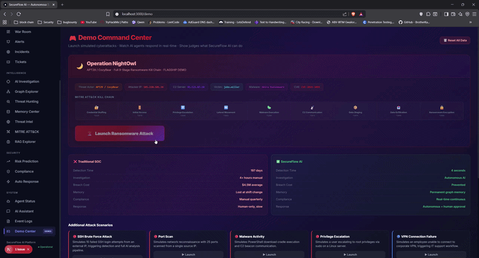
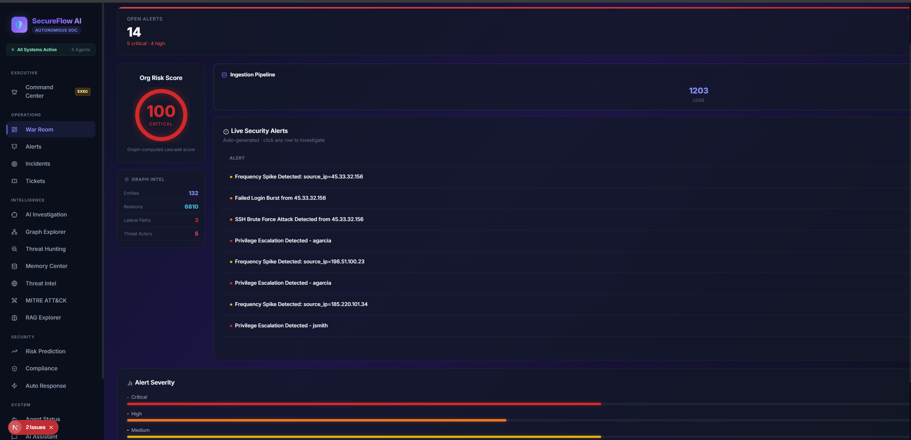
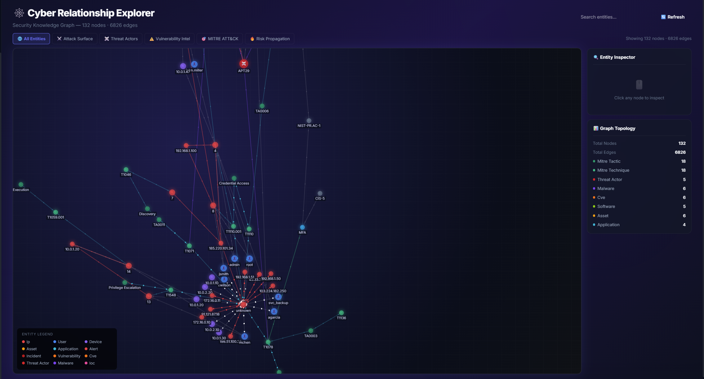
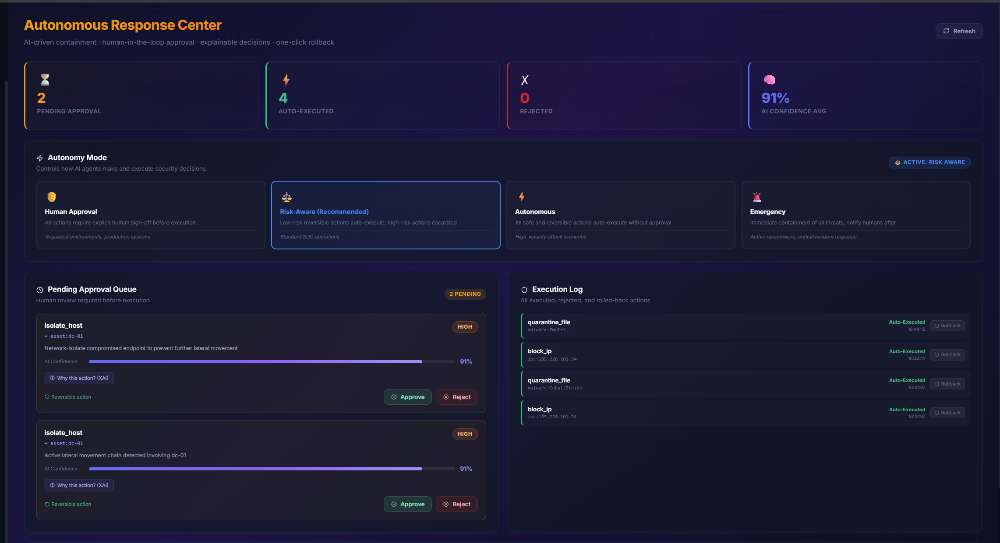
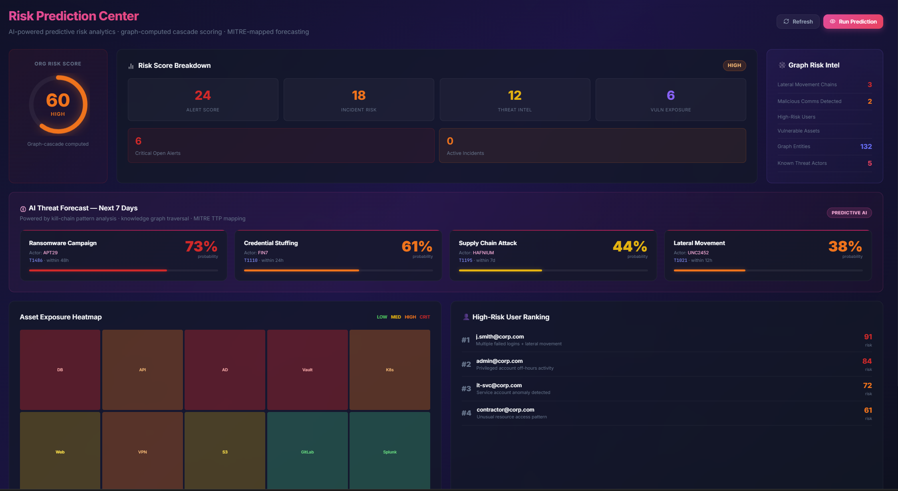
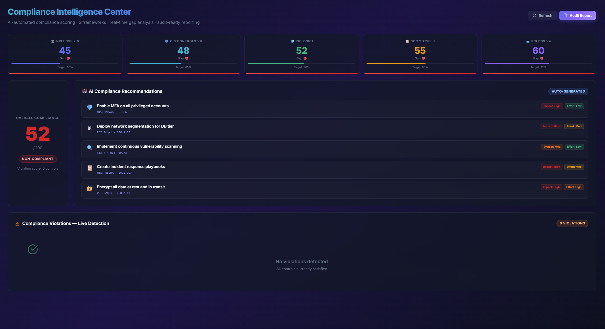

<div align="center">

# 🛡️ SecureFlow AI
### Autonomous Security Operations Platform

> *"197 days to detect a breach. We built the system that does it in 4 seconds."*



[](#)
[](#)
[](#)
[](#)
[](#)

**[🎬 Watch Demo](DEMO.md) · [⚡ Quick Start](#quick-start) · [📐 Architecture](ARCHITECTURE.md) · [🤖 Agents](AGENTS.md) · [👨‍⚖️ Judges](JUDGES.md)**

</div>

---

## 🚨 The Problem

Modern Security Operations Centers are drowning.

- **10,000–100,000 alerts per day** — analysts meaningfully investigate < 0.05%
- **197-day average breach detection time** — attackers operate undetected for months  
- **$4.5M average breach cost** — 69 days to contain after detection
- **3.4M unfilled cybersecurity jobs globally** — teams are permanently understaffed
- **Zero institutional memory** — when an analyst leaves, their knowledge leaves with them

Existing tools (SIEMs, EDRs, SOARs) generate data. They do not *think*, *connect*, or *remember*.

---

## 💡 The Solution

**SecureFlow AI** is an autonomous security team — five specialized AI agents permanently online,
sharing a Security Knowledge Graph and organizational memory, continuously learning from every attack.

```
Threat Detected (4 seconds)
       ↓
🎯 Triage Agent classifies priority
       ↓
🔍 Investigation Agent traces attack chain
       ↓
🌐 Threat Intel Agent enriches from graph
       ↓
🧠 Memory Agent recalls past incidents
       ↓
🔮 Risk Agent predicts cascade impact
       ↓
⚡ Response Agent recommends + executes (with approval)
       ↓
📊 Executive Dashboard auto-generates CISO report
```

**What makes SecureFlow AI unique:**
1. **Graph + Memory combination** — No SOC platform connects knowledge graph intelligence with organizational episodic memory
2. **XAI on every autonomous action** — Every AI decision shows its evidence chain before acting
3. **Predictive security** — We don't just detect what happened; we forecast what's about to happen

---

## 👨‍⚖️ For Judges: How to Evaluate This Project

If you only have 5 minutes to test SecureFlow AI, follow this exact path:

1. **Start the Demo:** Go to [`http://localhost:3000/demo`](http://localhost:3000/demo) and click **"Launch Full Ransomware Attack"**. This simulates 9 stages of an APT29 attack.
2. **Watch the AI Triage:** Go to [`http://localhost:3000/alerts`](http://localhost:3000/alerts) to see the `Triage Agent` automatically prioritizing the incoming simulated logs.
3. **Trace the Kill Chain:** Go to [`http://localhost:3000/graph`](http://localhost:3000/graph) to view the **Security Knowledge Graph**. Watch the nodes turn red as the blast radius computes the cascading risk of the ransomware spreading.
4. **Test Autonomous XAI:** Go to [`http://localhost:3000/autonomous`](http://localhost:3000/autonomous). See the `Response Agent` generating playbooks. Click **"View AI Reasoning"** to see the Explainable AI (XAI) evidence chain.
5. **View the CISO Report:** Go to [`http://localhost:3000/executive`](http://localhost:3000/executive) to see how the `Reporting Agent` has synthesized the live attack into a boardroom-ready presentation and mapped it to Compliance frameworks.
6. **Test the Episodic Memory:** Go to [`http://localhost:3000/memory`](http://localhost:3000/memory) and click **"Simulate Nightly Consolidation"** to see the system learn from the attack, burning it into ChromaDB vector memory for future recall.

*For full evaluation criteria mapping, see [JUDGES.md](JUDGES.md).*

---

## 🏗️ Architecture


| Layer | Technology | Purpose |
|---|---|---|
| **Frontend** | Next.js 16, React, Vanilla CSS | 20-page enterprise dashboard |
| **Backend** | FastAPI, Python 3.10, SQLAlchemy | REST API + agent orchestration |
| **Knowledge Graph** | NetworkX, custom GraphRAG | Entity relationships + risk propagation |
| **Memory** | SQLite + semantic indexing | Episodic incident memory |
| **RAG Engine** | GraphRAG Fusion | MITRE ATT&CK grounded intelligence |
| **Database** | SQLite (→ PostgreSQL in prod) | Event, Alert, Incident, Ticket storage |

---

## 🤖 AI Agents

| Agent | Role | Speed | MITRE Integration |
|---|---|---|---|
| 🎯 **Triage** | Classify alerts P1–P4, route to workflows | < 2s | Technique mapping |
| 🔍 **Investigation** | Correlate alerts, trace attack chains, collect evidence | < 5s | Kill chain analysis |
| 🌐 **Threat Intelligence** | Enrich IOCs, identify threat actors via graph | < 3s | Actor attribution |
| 🧠 **Memory** | Recall similar past incidents, surface past mitigations | < 1s | Pattern matching |
| 🔮 **Risk Prediction** | Cascade risk scoring, attack probability forecast | < 4s | Impact prediction |
| ⚡ **Autonomous Response** | Recommend + execute containment with XAI + human approval | On approval | Response playbooks |

---

## 🕸️ Security Knowledge Graph

The graph is the intelligence core of SecureFlow AI.

- **90 nodes** across 17 entity types (IPs, Users, Devices, Assets, CVEs, Threat Actors, MITRE Techniques...)
- **234 relationships** mapping attack paths, vulnerabilities, and threat actor TTPs
- **Real-time risk propagation** — computes cascade impact from any compromised entity
- **GraphRAG fusion** — combines graph traversal with RAG retrieval for grounded intelligence

```
APT29 ──uses──► T1110 (Brute Force) ──targets──► VPN-Gateway
  └──deploys──► Akira-Ransomware ──encrypts──► DB-PROD-01
       └──linked_to──► CVE-2024-3094 ──affects──► WKSTN-047
```

---

## 🧠 Organizational Memory

SecureFlow AI never forgets. The Memory Agent stores every incident as a semantic embedding
and retrieves similar past events during new investigations.

```
New Alert: Brute Force from 185.220.101.34
    ↓
Memory Query: similarity search (cosine distance)
    ↓
Match Found: INC-104 (March 2024, similarity: 0.89)
    ↓
Recall: "VPN geo-block + forced password reset resolved this"
    ↓
Apply: learned mitigation template to new incident
```

---

## 📊 Executive Dashboard

The CISO gets a real-time boardroom briefing — no analyst hours, no report writing.

- **Live Risk Score** — org-wide gauge computed from graph traversal
- **5-Framework Compliance** — NIST, CIS, ISO 27001, SOC 2, PCI DSS auto-mapped
- **AI Threat Forecast** — Next 7 days predicted attacks with probability scores
- **One-Click CISO Report** — Full boardroom PDF generated from live data

---

## 🎮 Demo: Operation NightOwl

Navigate to `/demo` and click **🚨 Launch Ransomware Attack** to trigger:

| Stage | Technique | Description |
|---|---|---|
| 1 | T1110 | 47 VPN credential stuffing attempts from APT29 IP |
| 2 | T1078 | Successful login with compromised credential |
| 3 | T1068 | Privilege escalation via CVE-2024-3094 |
| 4 | T1021 | WMI lateral movement WKSTN-047 → API-GW-01 |
| 5 | T1204 | Akira ransomware dropped (YARA match) |
| 6 | T1071 | CobaltStrike C2 beacon to 91.121.87.18 |
| 7 | T1074 | 2.3GB customer data staged |
| 8 | T1048 | Data exfiltrated via TOR exit node |
| 9 | T1486 | 3,847 files encrypted (.akira extension) |

All 5 AI agents respond autonomously. Navigate to `/graph` to see risk propagation.

---

## Screenshots

| War Room | Knowledge Graph |
|---|---|
|  |  |

| Autonomous Response + XAI | Executive Dashboard |
|---|---|
|  |  |

| Risk Prediction | Compliance Intelligence |
|---|---|
|  |  |

---

## ⚡ Quick Start

### Prerequisites
- Python 3.10+
- Node.js 18+
- Git

### 1. Clone
```bash
https://github.com/sudu787/secureflow-ai.git
cd secureflow-ai
```

### 2. Configure Environment (CRITICAL FOR AI AGENTS)
```bash
cp .env.example .env
```
Edit `.env` and add your API keys:
- `GEMINI_API_KEY=your_key_here` (Powers the Investigation & Reporting Agents)
- `GROK_API_KEY=your_key_here` (Powers the Triage & Autonomous Agents)
- `GROQ_API_KEY=your_key_here` (Powers the IT Support Agent fallback)

### 3. Start Backend

**For Windows (PowerShell):**
```powershell
cd backend
python -m venv venv
.\venv\Scripts\Activate.ps1
$env:PYO3_USE_ABI3_FORWARD_COMPATIBILITY=1
pip install -r requirements.txt
python -m uvicorn app.main:app --reload --port 8000
```

**For macOS/Linux:**
```bash
cd backend
python3 -m venv venv
source venv/bin/activate
export PYO3_USE_ABI3_FORWARD_COMPATIBILITY=1
pip install -r requirements.txt
python -m uvicorn app.main:app --reload --port 8000
```

### 4. Start Frontend
Open a **new terminal window/tab**, then run:
```bash
cd frontend
npm install
npm run dev
```

### 5. Open & Test
```
http://localhost:3000        ← Full platform
http://localhost:3000/demo   ← Launch ransomware simulation
http://localhost:8000/docs   ← FastAPI interactive API docs
```

---

## 🏆 Innovation Highlights

| Innovation | What It Is | Why It's Novel |
|---|---|---|
| **GraphRAG Fusion** | Graph traversal + vector RAG combined | No existing SOC tool does both simultaneously |
| **Episodic Memory** | Semantic search over past incidents | Prevents repeated mistakes across analyst shifts |
| **XAI Evidence Chain** | Every AI action cites its reasoning | Makes autonomous security trustworthy |
| **Cascade Risk Propagation** | Real-time graph-computed blast radius | Predicts attack path before completion |
| **Continuous Compliance** | Auto-maps live alerts to 5 frameworks | Replaces quarterly manual compliance audits |
| **Predictive Threat Intel** | Probability forecasts for future attacks | Forward-looking, not reactive |

---

## 🗺️ Roadmap

- [ ] Real SIEM connector (Splunk, QRadar, Microsoft Sentinel)
- [ ] Federated threat graph sharing between organizations
- [ ] Natural language SOC interface ("Show me all APT29 activity this week")
- [ ] Autonomous playbook generation from memory patterns
- [ ] Mobile CISO app with push alerts
- [ ] LLM fine-tuning on organization-specific threat data

---


## 📄 License

MIT License — see [LICENSE](LICENSE)
